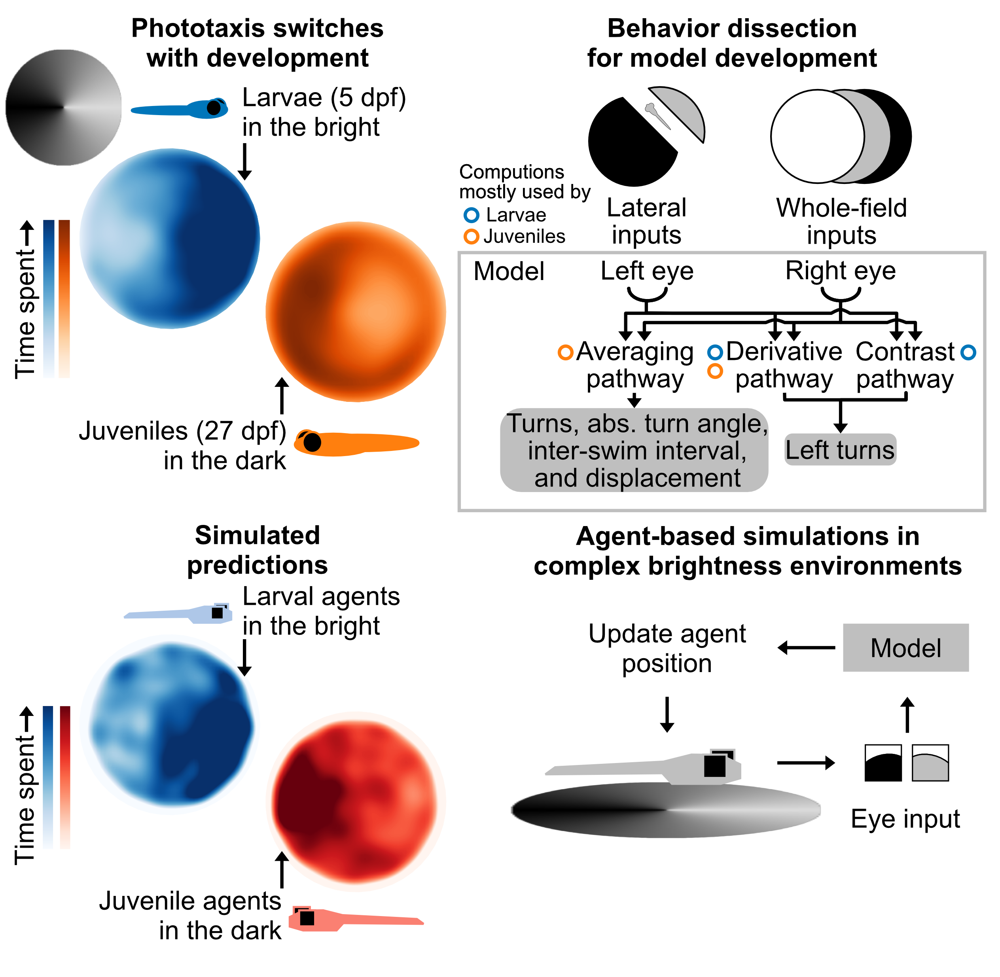

# Behavioral algorithms of ontogenetic switching in larval and juvenile zebrafish phototaxis
**Authors**: Maxim Q. Capelle, Katja Slangewal, and Armin Bahl

This code provides analysis and modeling tools for quantifying and simulating
phototactic behavior in larval and juvenile zebrafish.
The code extracts, compares, and fits behavioral algorithms from 
experimental data to reveal developmental switches in phototaxis.

If you use this code in your work, please cite our paper:
Capelle et al., [Paper Title], [Journal Name], [Year]
([DOI link])

### Folder Structure
- `figures/` — Scripts for generating figures
- `settings/` — Configuration and settings files
- `utils/` — Utility modules and helper functions
- `requirements.txt` — List of required Python packages
- `readme.md` — Project documentation
- `prepare_data.py` — Script for preparing and processing of raw data
- `simulate.py` — Script for running simulations based on fitted models

### How to Run the Code
1. Install the required packages listed in `requirements.txt`.
2. Configure the settings in `settings/general_settings` as needed for your analysis (especially regarding the paths)
3. Run the scripts in the `figures/` directory to generate the desired figures. 
   The following dependencies between scripts should be noted:
   - `fig3.py` requires `fig3_fit_models.py`.
   - 'fig4B.py' requires fig1_and_4_all_agents.py`.
   - `figS5.py` requires `fig1_and_4_all_agents.py`.
   - `figS6.py` requires `fig2.py` and `fig3_fit_models.py`.
   - `figS7.py` requires `fig1_and_4_all_agents.py`.

Each script is named after its corresponding figure in the paper for easy reference.

