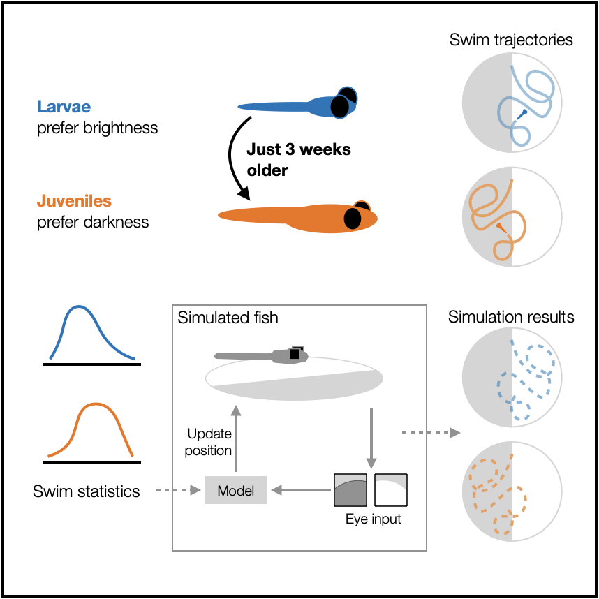

# Behavioral algorithms of ontogenetic switching in larval and juvenile zebrafish phototaxis
**Authors**: Maxim Q. Capelle, Katja Slangewal, and Armin Bahl

This code provides analysis and modeling tools for quantifying and simulating
phototactic behavior in larval and juvenile zebrafish, enabling the study of 
ontogenetic changes in their light-driven navigation strategies. It addresses
the challenge of extracting, comparing, and fitting behavioral algorithms from 
experimental data to reveal developmental switches in phototaxis.

If you use this code in your work, please cite our paper:
Capelle et al., [Paper Title], [Journal Name], [Year]
([DOI link])

### Folder Structure
- `figures/` — Scripts for generating figures
- `settings/` — Configuration and settings files
- `utils/` — Utility modules and helper functions
- `requirements.txt` — List of required Python packages
- `readme.md` — Project documentation

### How to Run the Code
1. Install the required packages listed in `requirements.txt`.
2. Configure the settings in `settings/general_settings` as needed for your analysis (especially regarding the paths)
3. Run the scripts in the `figures/` directory to generate the desired figures.
    fig1_performance_scores.py requires fig1_and_4.py to be run first.
    fig3.py requires fig3_fit_models.py to be run first.
    figs6_extended_model.py requires fig2.py and fig3_fit_models.py to be run first.

